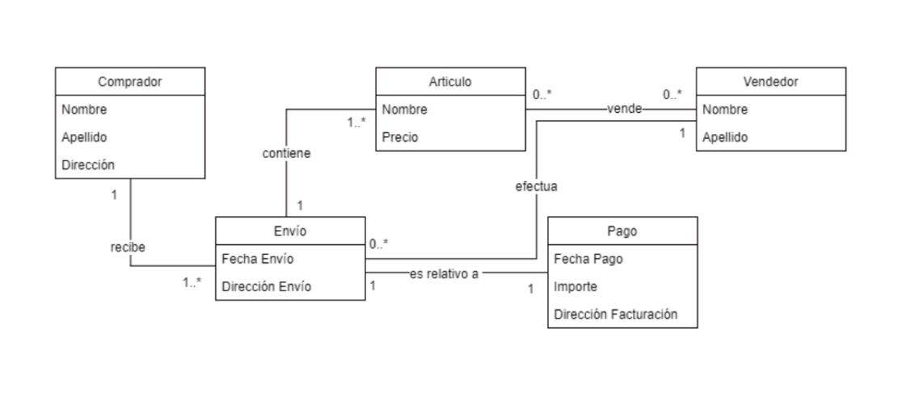

### Individual 30

Considere el siguiente diagrama de clases:

Se pide que realice lo siguiente:

- Cree un proyecto Java.
- Cree un paquete con un nombre alusivo al ejercicio.
- Agregue las cinco clases indicadas en el diagrama. Use tipos de datos adecuados de acuerdo
con la función asociada a cada campo.
- Agregue a cada clase los métodos accesores, mutadores y toString.
- Comprima la carpeta del proyecto